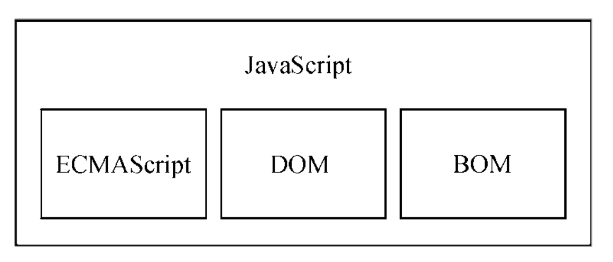

# 【第一章】什么是JavaScript

## 1.1 简短的历史回顾

随着 Web 日益流行，但网页变得越来越大、越来越复杂，为验证简单的表单而需要大量与服务器的往返通信成为用户的痛点。

1995 年，网景公司的Brendan Eich与Sun 公司合作开发了一种在客户端和服务器端都使用的叫LiveScript的脚本语言，为蹭Java的热度，改名为 JavaScript。JavasScriot1.0很成功，于是微软也大力参与进web来了,发布了 IE3，其中包含自己名为 JScript（叫这个名字是为了避免与网景发生许可纠纷)的JavaScript 实现。

现在，两个版本的JavaScript（Netscape Navigator 中的 JavaScript，以及 IE 中的 JScript）的存在让JavaScript的规范化问题突显了。于是[标准ECMA-262](https://zh.wikipedia.org/wiki/ECMAScript)就被制定起来了。

自此以后，各家浏览器均以 ECMAScript 作为自己 JavaScript 实现的依据，虽然具体实现各有不同。

## 1.2 JavaScript实现

#### JavaScript的组成： 

### 1.2.1 ECMAScript

ECMA-262是一个标准，ECMAScript是ECMA-262 定义的语言。ECMA-262描述了ECMAScript的

- 语法
- 类型
- 语句
- 关键字
- 保留字
- 操作符
- 全局对象

ECMAScript 只是对实现这个规范描述的所有方面的一门语言的称呼。

JavaScript 实现了ECMAScript，而 Adobe ActionScript 同样也实现了 ECMAScript。ECMAScript并不局限于 Web 浏览器，Web 浏览器只是 ECMAScript 实现可能存在的一种宿主环境。宿主环境（如Node.js 和即将被淘汰 的 Adobe Flash）提供ECMAScript 的基准实现和与环境自身交互必需的扩展（如DOM）。

ECMA-262就像一个标准文档，ECMAScript就像一个由标准文档定义的规范接口，JavaScript就像一个具体实现。

::: tip 类比一下：

ECMA-262：国家规定的大楼的建筑规范

ECMAScript：所有符合规定的大楼的称呼 

JavaScript：某个开发商在建造完‘标准’大楼的前提上，给每个楼层额外装了监控
:::

### 1.2.2 DOM

Document Object Model：提供与网页内容交互的方法和接口

DOMLevel1：映射文档目录结构

DOMLevel2：新增以下内容

- DOM 视图：描述追踪文档不同视图（如应用 CSS 样式前后的文档）的接口
- DOM 事件：描述事件及事件处理的接口
- DOM 样式：描述处理元素 CSS 样式的接口
- DOM 遍历和范围：描述遍历和操作 DOM 树的接口

DOMLevel3：新增以下内容

- DOM Load and Save：以统一的方式加载和保存文档的方法
- DOMValidation：验证文档

### 1.2.3 BOM

Browser Object Model。提供与浏览器交互的方法和接口使用BOM，开发者可以操控浏览器显示内容之外的部分:

- 弹出新浏览器窗口的能力
- 移动、缩放和关闭浏览器窗口的能力
- navigator 对象，提供关于浏览器的详尽信息
- location 对象，提供浏览器加载页面的详尽信息
- screen 对象，提供关于用户屏幕分辨率的详尽信息
- performance 对象，提供浏览器内存占用、导航行为和时间统计的详尽信息
- 对 cookie 的支持
- 其他自定义对象，如 XMLHttpRequest 和 IE 的 ActiveXObject

