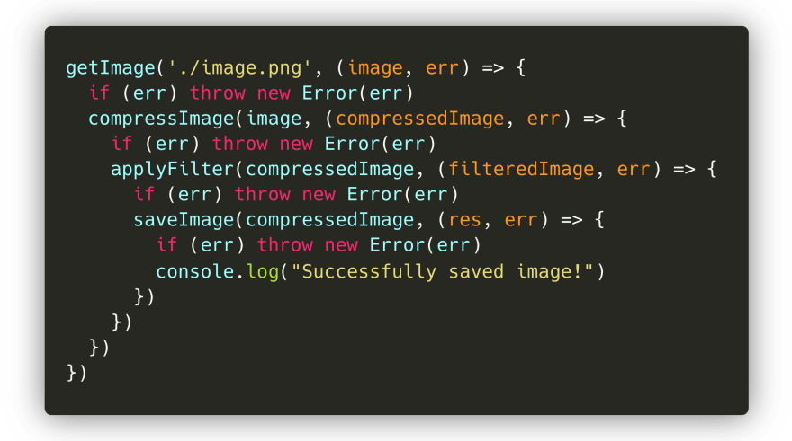
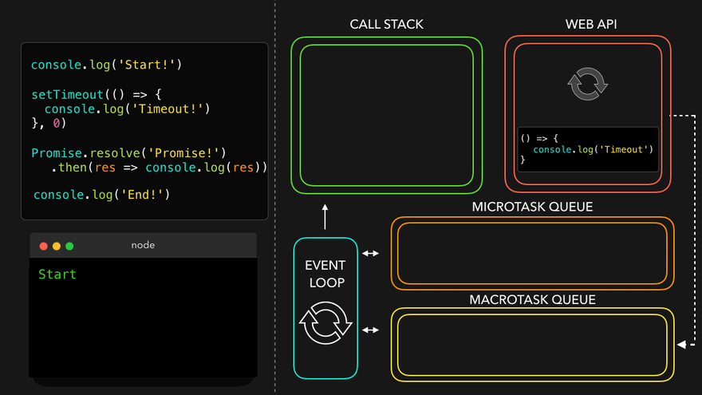
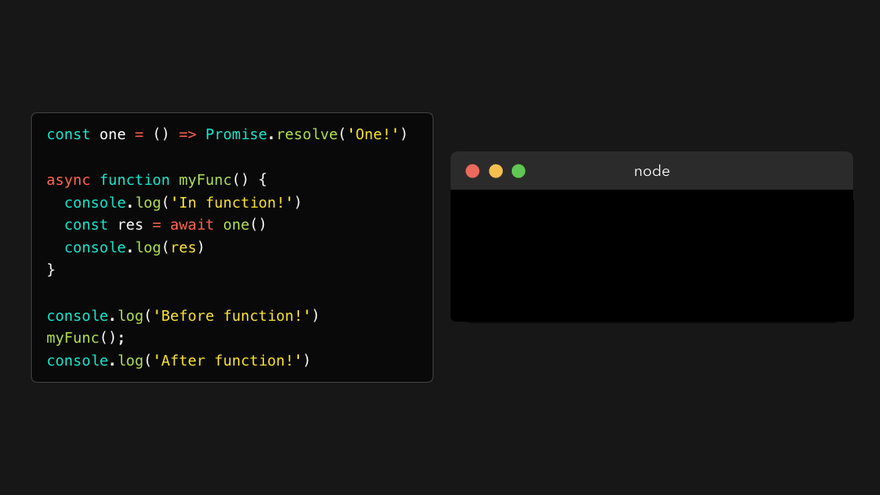

::: tip

本篇文章是怀着赞许与尊敬从[Lydia Hallie](https://dev.to/lydiahallie)的文章中翻译而来的，[原文](https://dev.to/lydiahallie/javascript-visualized-promises-async-await-5gke)写的实在是太性感了

:::

你是否有过这样的经历，跑一段JS代码，但它就是不按你预期地运行？看起来就像是一些函数被随机地，在不可预测的时间被执行了，或者执行被延迟了。那你可能正在与ES6引入的新特性打交道：**Promise** . 中文译名：期约

Promise是什么？为什么要用它？它到底是怎么工作的？如何使用它?

往下看之前最好先看看[*事件循环*](/translation/devto-jseventloop) 的原理. 如果你还没看过.

## 介绍

在编写JavaScript时，我们经常不得不处理依赖于其他任务的任务！假设我们想要获取一张图像，对其进行压缩，应用过滤器，然后将其保存。

我们需要做的第一件事，就是获取我们想要编辑的图像。*getImage* 函数可以解决这个问题！只有在成功加载该图像之后，我们才能将该值传递给 *resizeImage* 函数。当图像成功调整大小时，我们希望在 *applyFilter* 函数中对图像应用过滤器。在压缩图像并添加筛选器后，我们希望保存图像并让用户知道一切工作正常！

最后，我们会得到这样的结果：

虽然这么做也可以，但我们最终得到了许多嵌套的回调函数，它们依赖于前面的回调函数，这简直是回调地狱，这样的代码很难懂也很难维护。

幸运的是，现在我们有了Promise，让我们来看看什么是Promiss，以及它在这样的情况下可以如何帮助我们！

## Promise语法

我们可以使用一个接受回调函数的 *Promise构造函数* 来创建 *Promise* :

等等，这是返回了个什么玩意儿？

***Promise*** 是一个对象，包含着一个 **status**([[PromiseStatus]]) 属性和一个 **value**([[PromiseValue]])属性。从上面的动图中你可以看见 *[[PromiseStatus]]* 的值为 "pending"，*Promise* 的值为 *undefined* .

别担心--你不永远不必与此对象交互，甚至不能访问[[PromiseStatus]]和[[PromiseValue]]属性！但是，在使用Promises时，这些属性的值很重要。

::: tip

译者注：期约的状态是私有的，不能直接通过 JavaScript 检测到。这主要是为了避免根据读取到的期约状态，以同步方式处理期约对象。另外，期约的状态也不能被外部 JavaScript 代码修改。这与不能读取该状态的原因是一样的：期约故意将异步行为封装起来，从而隔离外部的同步代码

:::

*Promise* 的状态[[PromiseStatus]]有以下三种：

- ⏳  *pending* : promise既没有被兑现(fulfilled)，也没有被拒绝(rejected) , promise依旧悬而未决
- ✅  *fulfilled* ：promise已经被兑现(fulfilled)，一切都很顺利，没有发生任何错误
- ❌  *rejected* : promise已经被拒绝(rejected), 什么事情出错了

> 译者举例子：想象你叫了一辆滴滴，把从平台接单到司机把你送到目的地当做一个Promise,就是你和平台立下一个期约，约定在那个时间段内，平台派车把你送到目的地。
>
> 在你下单后，直到你被送到目的地前，这个状态都一直是 *pending*， 因为你还没有到目的地(promise还没有被兑现)，你也没有"到不了目的地"(promise还没有出错)
>
> 然后接下来会出现两种情况：
>
> 1. 你被安全地送到了目的地，promise被兑现，状态改成fulfilled
>
> 2. 司机接到电话，说他老婆突然要生孩子了，司机作为一个好男人，决定要去医院，不去接你了，取消了订单。
>
>    或者司机突然发现他没老婆，但是他开的是某度造的车，半路给你带到莆田系医院去了等等等等，总之就是出现问题了，那么promise的状态就成了rejected，因为promise没有被完成。

在上面的例子中，我们只是简单地传了一个回调函数 `() => {}` 给 *Promise* 构造器。然而，这个回调函数实际上接受两个参数：第一个参数常常被称作 `resolve` 或者 `res` , 是当 *Promise* 的状态应当改为 *fulfilled* 时触发。第二个参数常常被称作 `reject` 或者 `rej` , 是当 *Promise* 的状态应当改为 *reject* 时触发，表示有什么东西出错了

让我看看调用 `resolve` 或者`reject` 方法时会输出什么：

不错！我们终于知道如何摆脱 *pending* 状态和 *undefined* 值！如果我们调用了 `res` 函数，那么 *promise* 的状态就是 "fulfilled"，如果我们调用了`rej` 函数，那么 *promise* 的状态就是"rejected"。而*promise* 的值，既[[PromiseValue]]的值，就是我们传给 `res` 或者`rej`的值。

好了，现在我们对如何控制那个模糊的 *Promise* 对象有了更多的了解。但是它是用来做什么的呢？

在介绍部分中，我展示了一个示例，在该示例中，我们获取图像、压缩它、应用过滤器，并保存它！最终，这变成了一个疯狂嵌套回调的乱七八糟的局面。

幸运的是，*Promise* 可以帮助我们解决这个问题！首先，让我们重写整个代码块，以便每个函数返回一个 *Promise*。

如果图像已加载，并且一切正常，那就调用`res`来处理promise吧！否则，如果在加载文件时出现错误，那就调用`rej`来处理promise吧.

让我们看看当我们在终端中运行这段代码时会发生什么！

棒！正如我们预期的那样，返回了一个promise，其中包含已解析数据的值。

然后呢？我们不关心整个Promise对象，我们只关心数据的值！幸运的是，有一些内置的方法可以获得promise的值。对于promise，我们可以附加3种方法：

- `.then()`: 在promise执行`resolve`之后被执行
- `.catch()`: 在promise执行`reject`之后被执行
- `.finally()`: 无论promise执行`resolve`或者是`reject`，都会被执行

`.then`方法接受传递给`resolve`方法的值

`.catch`方法接受传递给`reject`方法的值

终于，我们得到了在没有整个Promise对象的情况下由Promise生成的值！我们现在可以用这个值做任何我们想做的事情。

------

仅供参考，当您知道promise将始终`resolve`或始终`reject`时，您可以使用要reject或resolve promise的值编写Promise.resolve或Promise.reject！（翻译不明白，太难翻译了，还是看图吧）

接下来你会经常看到这种语法

------

在*getImage*示例中，我们最终不得不嵌套多个回调才能运行它们。幸运的是，`.then` 处理程序可以帮助我们！

`.then` 方法本身的返回值也是一个promise值(注意是返回值哦，传给 *.then* 的是promise 的value，不是promise)，这意味着我们可以链接任意多个`.then`：前一个*then*回调的结果将作为参数传递给下一个*then*回调！

在*getImage*示例中，我们可以链接多个*then*回调，以便将处理后的图像传递给下一个函数！我们得到的不是许多嵌套的回调，而是一个干净的*then*链。

完美！这个写法可比之前的好多了

------

## （宏）任务队列和微任务队列

现在我们对如何创造 *promise* 以及如何从 *promise* 中提取值有了更多的了解。让我们再向脚本中添加一些代码，然后再次运行它：

等等，发生了什么！🤯

首先，“Start!” 被打印出来，这个没问题。然而第二个被打印出来的值居然是 "End!" ，而不是promise的resolve的值，"Promise!" 最后才被打印出来，发生了什么？

我们终于看到了 *promise* 的真正力量！虽然JavaScript是单线程的，但我们可以使用 *promise* 添加异步行为！

------

等一下，我[事件循环](/translation/devto-jseventloop)呢?难道我们不能使用浏览器原生的方法(如setTimeout)来创建某种异步行为吗？

当然可以！不过，在事件循环中，其实有两种类型的队列：**（宏）任务队列** 和 **微任务队列**，（宏）任务队列用于（宏）任务，微任务队列用于微任务。

那么什么是（宏）任务，什么又是微任务呢？常见的如下表所示，包括但不限于

|   种类    |                           任务                           |
| :-------: | :------------------------------------------------------: |
| (宏）任务 |       setTimeout` | `setInterval` | `setImmediate        |
|  微任务   | Promise callback` | `process.nextTick` | `queueMicrotask |

啊，我们在微任务列表中看到了Promise！当Promise调用其`then()`、`catch()`或`finally()`方法时，方法中的回调被添加到微任务队列中！这意味着`then()`、`catch()`或`finally()`方法中的回调不会立即执行，实质上是向我们的JavaScript代码添加了一些异步行为！

那么`then()`、`catch()`或`finally()`方法中的回调函数是什么时候执行的呢？事件循环为任务赋予不同的优先级：

1. 执行当前在调用堆栈中的所有函数。当它们返回值时，它们会从堆栈中弹出。
2. 当调用堆栈为空时，所有排队的微任务将逐个弹出到调用堆栈上，并被执行！(微任务本身也可以返回新的微任务，有效地创建了一个无限的微任务循环)
3. 如果调用堆栈和微任务队列都为空，事件循环就会检查(宏)任务队列上是否有剩余的任务。然后（宏）任务被弹出到调用堆栈上，执行，然后弹出！

------

让我们快速来看一个简单的例子：

- *Task1* : 一个立即添加到调用堆栈中的函数。在我们的代码中可以立即调用它。
- *Task2, Task3, Task4* ：微任务们。例如，一个promise的`then`回调函数，或者使用 *queneMicrotask* 添加的任务
- *Task5， Task6* : 一个(宏)任务队列, 例如，*setTimeout* 和 *setImmediate* 的回调函数

首先，*Task1*返回一个值，并从调用堆栈中弹出。然后，引擎检查微任务队列中排队的任务。一旦所有任务都被放入调用堆栈并最终弹出，引擎就会检查(宏)任务队列中的任务，这些任务被推到调用堆栈上，并在它们返回值时被弹出。

也就是说，事件执行的优先级顺序为：**同步函数 > 微任务(不进入Web API) > (宏)任务**

现在我们用一些真正的代码来使用它！

在这段代码中，我们有宏任务*setTimeout*和微任务Promise *then()*回调。一旦引擎到达setTimeout函数行。让我们一步一步地运行这段代码，看看记录了什么！

在第一行，引擎遇到console.log()方法。它被添加到调用堆栈，之后打印出值*start！*到控制台。该方法从调用堆栈中弹出，引擎继续。

接着引擎遇到*setTimeout*方法，该方法被推到调用堆栈。*setTimeout*方法是浏览器原生的：它的回调函数`()=>console.log(‘in timeout’)`将被添加到Web API(此时*setTimeout*已经返回了值，被弹出堆栈)，直到计时器结束。尽管我们为计时器提供了值0，但是回调仍然首先被推送到Web API，然后被添加到(宏)任务队列：*setTimeout*是一个宏任务！

继续，引擎遇到*Promise.resolve()*方法。*Promise.resolve()*方法被添加到调用堆栈中，after which is resolves with the value `Promise!`. Its `then` callback function gets added to the **microtask queue**.（翻译不来，自己理解）

往下，引擎遇到console.log()方法。它会立即添加到调用堆栈中，然后打印出值*End！*到控制台，从调用堆栈中弹出，引擎继续。

紧接着，引擎发现调用堆栈现在为空。由于调用堆栈为空，它将检查微任务队列中是否有排队的任务！是的，确实有，promise的 *then* 回调函数已经迫不及待了！它被推入进调用堆栈中，然后输出Promise的resolved的值：在本例中是字符串`Promise！`

引擎发现调用堆栈为空，因此它将再次检查微任务队列，以查看是否还有任务在排队。不，微任务队列都是空的。

现在是检查(宏)任务队列的时候了：*setTimeout*回调仍在那里等待！*setTimeout*回调被推入进调用堆栈。回调函数返回*console.log*方法，该方法记录字符串`“In Timeout！”`。*setTimeout*回调从调用堆栈中弹出。

终于完成了！看起来也就那么亿点点复杂嘛.

------

## Async / Await

ES7引入了一种新的方式来在JavaScript中添加异步行为，并使得使用 *Promise* 变得更容易！通过引入*async*和*await*关键字，我们可以创建隐式返回承诺的异步函数。但是我们怎么能做到这一点呢？。

在前面，我们看到可以使用*Promise*对象显式创建承诺，无论是通过键入`new Promise(()=>{})`、*Promise.resolve*还是*Promise.reject*。

我们现在可以创建隐式返回对象的异步函数，而不是显式使用*Promise*对象！这意味着我们不再需要自己编写任何*Promise*对象。

尽管 *async* 函数隐式返回 *promises* 的事实不可置否，但在使用*await*关键字时，才可以看到*async*函数的真正威力！使用*await*关键字，我们可以挂起异步函数，同时等待被 *await* 的值返回已解析的承诺。如果我们想要获得这个已解析承诺的值，就像我们之前对*then()*回调所做的那样，我们可以将变量赋给等待的承诺值！

所以，我们可以暂停异步功能？好的，很好，但是..这到底是什么意思？

让我们看看当我们运行以下代码块时会发生什么：

发生了什么？

首先，引擎遇到一个`console.log`。它被推入到调用堆栈上，打印出 *Before function*。

然后，我们调用异步函数`myFunc()`，然后运行*myFunc*的函数体。在函数体的第一行，我们调用另一个`console.log`，打印出`In function!`

------

函数体继续被执行，这将我们带到第二行。最后，我们看到一个*await*关键字！。

在这里发生的第一件事是执行*await*后的值：在这里是 *one* 函数。它被推入到调用堆栈上，并最终返回一个已解析的承诺。一旦承诺被解析并且 *one* 函数返回了值，引擎就会遇到*await*关键字。**注意是先执行紧跟在await后的表达式然后再挂起async函数**。

当遇到*await*关键字时，*async*函数被挂起。函数体的执行暂停，*async*函数的其余部分在微任务中运行，而不是在常规任务中运行！

------

现在*async*函数*myFunc*由于遇到*await*关键字而挂起，引擎跳出异步函数并继续在调用异步函数的执行上下文中执行代码：在本例中是全局执行上下文！

------

最后，已经没有任务需要在在全局执行上下文中运行！事件循环检查是否有任何微任务在排队：确实有！异步*myFunc*函数在解析*one*的值后排队。*myFunc*推入调用堆栈，并在之前停止的地方继续运行。

变量*res*最终获得它的值，即promise的`resolve`的值！我们调用`console.log`打印出*res*的值：字符串`one!`并从调用堆栈中弹出！。

终于，一切都完成了！你有没有注意到，与*promise*相比，*async*功能有何不同？*await*关键字挂起异步函数，而如果我们当时使用了Promise的`.then()`，那么Promise将继续执行！

> 翻译到后面感觉翻译地乱七八糟的。阅读原文移步[这里](https://dev.to/lydiahallie/javascript-visualized-promises-async-await-5gke)